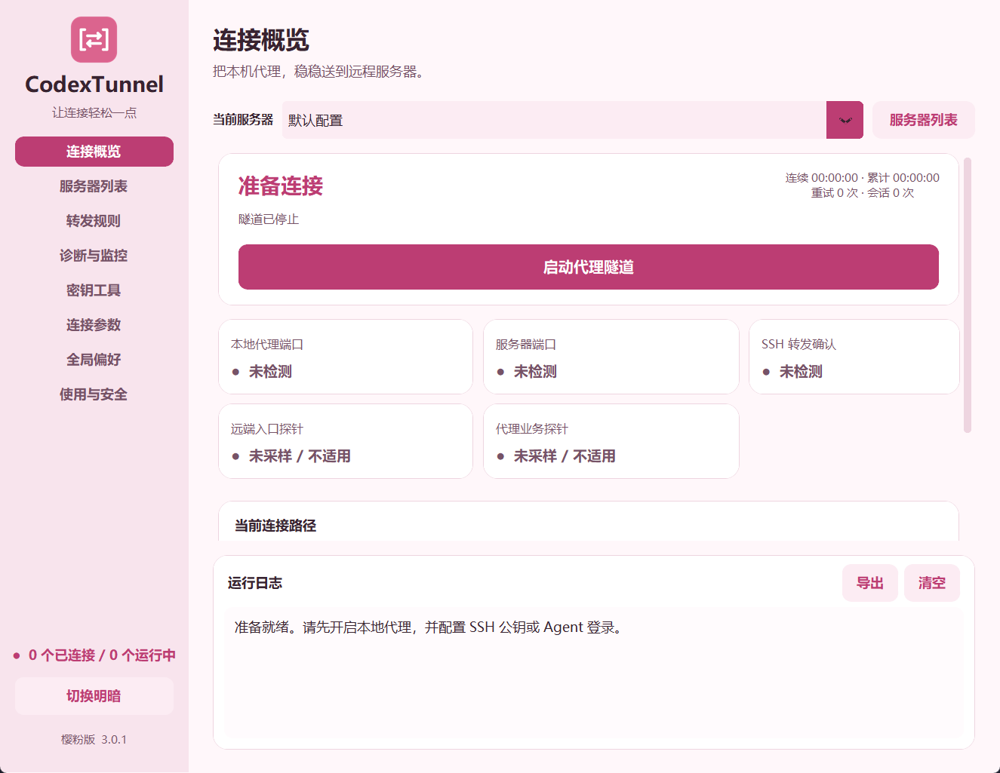
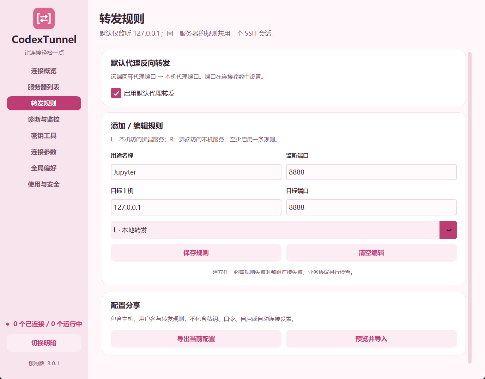

# CodexTunnel 樱粉版 3.0.1

Windows SSH 隧道与端口转发管理器。支持多服务器并发、结构化转发规则、分层探测、代理诊断与只读监控，粉色浅色/深色界面和简约隧道图标。

## 下载与首次配置

从 [GitHub Releases](https://github.com/wangliang-2025/CodexTunnel/releases/latest) 下载 `CodexTunnel-v3.0.1.exe`，或下载便携 ZIP 后解压。EXE 已包含 Python 和 GUI 依赖，无需单独安装 Python。建议放在固定目录，例如 `D:\Apps\CodexTunnel\`；启用登录自启后不要随意移动该文件。

运行环境：Windows 桌面、系统 OpenSSH 客户端。当前发布在 Windows x64 / Python 3.12 环境构建与验证；尚未验证 Windows ARM64 和其他平台。远端 SSH 转发要求服务器允许对应端口转发；仪表盘适用于提供 Python 3 与 `/proc` 的 Linux。

发布附件包括版本化 EXE、便携 ZIP、`SHA256SUMS.txt`、`release.json`。GitHub 同时提供对应标签的源码 ZIP / tar.gz。可用 PowerShell 核验下载文件：

```powershell
Get-FileHash .\CodexTunnel-v3.0.1.exe -Algorithm SHA256
```

将输出与 Release 的 `SHA256SUMS.txt` 对照。当前构建没有 Authenticode 数字签名；下载应使用本仓库的 Release 页面。

首次连接步骤：

1. 启动本机 HTTP 或 mixed 代理，确认监听地址为 `127.0.0.1`，记下端口。默认示例是 `7897`，应按实际情况修改。
2. 在“连接参数”中将 `server.example.com` 和 `user` 替换为自己的 SSH 地址与用户名，填写 SSH 端口和认证方式。这些默认值只是示例，首次启动不会自动连接。
3. 通过可信渠道核实服务器 SSH 主机公钥指纹。默认 `accept-new` 接受首次见到的主机，但拒绝已记录主机的密钥变化；较严格的环境可以预先建立 `known_hosts` 并选择严格校验。
4. 配置可供 OpenSSH 使用的密钥，或在“密钥工具”中生成并复制公钥。把公钥安装到服务器账户的 `~/.ssh/authorized_keys`，不要上传私钥。
5. 有口令的私钥需先加入运行中的 Windows `ssh-agent`。软件的“Agent 解锁”会打开原生交互窗口；主隧道采用非交互认证，不能在后台等待输入密码。
6. 确认默认远端监听端口 `17897` 未被占用，保存配置并启动连接。全部转发监听确认后才显示隧道已建立，再执行业务探测。
7. 如需服务器上的程序使用本机代理，在**服务器终端**设置下列示例变量；该设置只影响当前终端及其子进程。

```bash
export http_proxy=http://127.0.0.1:17897
export https_proxy=http://127.0.0.1:17897
export all_proxy=http://127.0.0.1:17897
curl --proxy http://127.0.0.1:17897 https://www.google.com/generate_204 -I
```

关闭终端代理设置：

```bash
unset http_proxy https_proxy all_proxy HTTP_PROXY HTTPS_PROXY ALL_PROXY
```

请求路径：远端程序 → 远端回环端口 → SSH 加密隧道 → Windows 回环代理端口 → 代理上游。SSH 主机仍需要通过正常网络可达；隧道不能替代 SSH 入口的 VPN 或网络路由。

检查 Windows OpenSSH 是否安装：

```powershell
Get-Command ssh.exe, ssh-keygen.exe, ssh-add.exe
```

若缺少客户端，可在 Windows 设置的“可选功能”中安装 OpenSSH 客户端。需要 Agent 时可由管理员按本机管理策略启用服务：

```powershell
Get-Service ssh-agent
Set-Service ssh-agent -StartupType Automatic
Start-Service ssh-agent
```

软件不会自动提升权限、修改服务或替你安装服务器公钥。

## 运行与升级

直接运行 `dist/CodexTunnel-v3.0.1.exe`，单文件已包含 Python 与 GUI。系统需要 Windows OpenSSH 客户端；有口令的密钥先通过密钥工具页的 Agent 解锁操作加入已启动的 ssh-agent。

配置位于当前用户 `AppData/CodexTunnel/config.json`。旧版配置会迁移到 schema 3；首次保存迁移前保留带内容摘要的 `.v2-*.bak`。全局偏好独立存储，旧版 EXE 不能完整识别新增规则与全局偏好，回退前保留当前配置并使用旧格式备份。

## 界面入口

| 页面 | 功能 |
|---|---|
| 连接概览 | 当前服务器选择、启动/停止、分层状态、连续/累计连接计时、重试和会话次数、代理命令、独立日志 |
| 服务器列表 | 新建配置、独立启动/停止、启动全部/停止全部、分享导入导出；最多 5 个同时运行的连接 |
| 转发规则 | 默认代理反向转发、最多 16 条附加 -L/-R 规则、启用/停用、编辑删除、分享当前配置 |
| 诊断与监控 | 三个标签页：健康与测速、代理与流量、服务器仪表盘 |
| 密钥工具 | Ed25519 原生生成向导、公钥与 SHA256 指纹、密钥引用、ssh-agent 解锁 |
| 连接参数 | 当前服务器地址、认证、默认代理端口、重连和 SSH 保活；逐服务器自动连接 |
| 全局偏好 | 登录自启、启动入托盘、自动连接延迟、主题、隐私、健康探测、网络变化、Toast 与静音时段 |
| 使用与安全 | 基础使用与信任边界 |

默认保持回环监听。多服务器只是切换查看项时不会互相停止；编辑当前服务器要求该服务器停止，不影响其他服务器运行。

## 转发规则

- 默认代理规则：`-R 127.0.0.1:远端端口:127.0.0.1:本机代理端口`，用于让服务器使用本机 HTTP/mixed 代理。
- L 本地转发：本机 `127.0.0.1:监听端口` → 服务器视角的目标主机与端口，例如 Jupyter 或数据库。
- R 反向转发：远端 `127.0.0.1:监听端口` → 本机视角的目标主机与端口。
- 每个服务器的规则共用 SSH 会话；任一必需规则建立失败会使整组失败。全部规则收到对应监听确认才显示已建立。
- L 监听确认不等于后端应用已就绪。R 入口 TCP 探针不等于所有目标业务协议已通过。
- 检查同一配置重复监听、跨服务器本地监听冲突与同一主机/SSH 端口的远端监听冲突；域名别名、不同 SSH 入口是否落到同一实际主机仍以服务端回应为准。
- 当前不开放公网监听、不接受任意 SSH 参数、不支持动态 -D 或继承 ProxyJump。

## 自启、计时与通知

登录启动使用 HKCU Run，是当前用户登录后的桌面启动。保持新版 EXE 的路径稳定后开启该选项；移动文件或换用其他版本路径后应在新版重新设置。每台服务器可分别选择是否启动后自动连接，全局自动连接延迟允许等待网络与代理就绪。

计时区分当前连续连接和本次软件运行期间累计连接，重连后连续计时归零。它是已建立会话的经过时间，不证明休眠期间业务可用，也不提供跨软件重启的长期 SLA。

Toast 默认关闭，可设置故障持续阈值、冷却和跨午夜静音时段。持续断线/错误或业务降级触发一次故障通知，已通知的故障恢复后通知恢复；手动停止不报故障。内容采用通用提示，避免泄露主机。启用后通过 Windows 原生通知接口注册当前用户应用标识并发送；系统通知开关或勿扰可能阻止显示，失败记录在日志。通知不带远程命令和操作按钮。

## 分层健康与网络变化

本地代理 TCP、服务器 TCP、SSH 监听确认、远端 R 入口、代理业务独立展示。默认自动探测间隔 90 秒，连续失败 3 次显示降级；可调整、关闭自动探测并手动执行。远端入口探针需要 Python 3；代理业务探针需要 curl 和远端命令执行权限。受限账户/缺少工具显示方式不可用，不因单一网站失败杀掉正常 SSH。

每服务器至多一个自动探测任务，超时与取消都回收所属进程。网络接口事件合并约 3 秒后复核，休眠恢复也触发复核；网络恢复不会重启用户手动停止的连接。底层使用 Windows NotifyIpInterfaceChange，退出注销。自动重连保留指数退避，认证、指纹和转发永久错误停止。

## Clash / Mihomo 与流量图

“代理与流量”页设置本机控制端口（默认 9090）与可选 token。只访问 `127.0.0.1`，只读 `/configs`、`/version`、`/traffic`，禁用 API 重定向和环境代理，限制超时与响应大小。token 仅存在本次内存，不写配置、日志或分享文件。

检测少量常用本机端口及控制 API 提供的 HTTP/mixed 端口，通过 HTTP CONNECT 验证后列出候选。无法证实品牌时明确显示普通 HTTP 代理候选。运行中的连接不会自动改端口；应用推荐需要在软件中显式操作。SOCKS-only 端口不作为已验证 HTTP 代理推荐。

流量图在勾选且该标签页可见期间每 2 秒采样，保存最近 120 个有效样本。**统计来源是 Mihomo 核心总流量，包含其他应用，不是单条 SSH 隧道流量。** 单位 KiB/s；采样失败显示原因，保留上次数据，不填充虚假零值。

## 诊断与限量测速

本机代理与远端隧道代理分别测试。延迟每次 3 个样本，显示成功率、中位数和入口 DNS/TCP/CONNECT+TLS/首字节/总耗时；请求阶段计时不包含 SSH 建连。DNS 是 curl 本地解析阶段（通常是代理入口），CONNECT+TLS 包含代理协商与 TLS，并非独立测得目标 DNS 或纯 TLS 耗时。HTTP 401/403 只说明目标已响应，不代表 API 授权；407、TLS 失败、超时均不算成功。

下载测速由用户手动触发，固定 Cloudflare HTTPS 测试地址，最多读取 1 MiB，不保存响应。设置读取超时、总任务超时与取消；远端下载需要 Python 3。该上限描述应用读取量，网络栈预读与握手等协议开销可能额外产生少量流量。结果表示当时链路样本，不是隧道理论上限。

## 密钥工具

生成向导在原生 OpenSSH 窗口接收密钥口令，不把口令写入参数、日志或配置；不自行实现加密。暂存目录限制权限，使用 create-if-absent 的 NTFS 硬链接发布生成结果，已有公钥或私钥均拒绝覆盖。Windows OpenSSH 的私钥 ACL 允许所有者及系统管理账户，不允许普通 Users/Everyone 访问。

生成完成显示公钥与指纹，可以复制公钥并应用密钥文件引用；不会自动修改服务器 authorized_keys。Agent 解锁需要 Windows ssh-agent 服务已启动。两项交互任务均可取消，最长等待 5 分钟，退出回收原生子进程。输出目录应采用支持硬链接的本地 NTFS；不支持时安全失败。

## 配置分享

分享格式 `CodexTunnelShare` schema 1，JSON 导出预览明确显示主机和用户名。排除私钥本体/路径、口令、token、应用偏好、自启、自动连接与本机稳定 ID。

导入最大 1 MiB、最多 100 个预设；严格字段白名单和类型/端口/主机/规则验证，未知字段拒绝。预览后导入，名称冲突自动改名，新建独立 ID，默认不自动连接。导入不执行命令、不安装依赖、不自动信任 known_hosts。导入导出只处理已保存的配置。

## 远端仪表盘

“服务器仪表盘”提供 Linux CPU、1 分钟负载、内存、根分区、运行时长与非回环网卡聚合收发速率。需要 Python 3、/proc 和只读命令执行权限，无 sudo、不安装服务、不结束进程。

手动读取或勾选在显示且当前隧道已连接期间每 30 秒刷新；CPU 百分比与网卡速率需要两个样本。网卡是所有非回环接口计数的总和，虚拟接口可能导致重复统计，不能解释为某个实验或隧道的流量。切换服务器会清空当前显示，旧回调不能覆盖新选择。

## 验证与构建

```powershell
python -m unittest discover -s tests -p test_*.py -v
python tests/visual_smoke.py
python tests/workspace_visual_smoke.py
python build_exe.py
.\dist\CodexTunnel-v3.0.1.exe --smoke-test-report .\artifacts\exe-smoke.json
```

构建先执行全部回归测试，生成图标并保留旧 EXE，再输出独立版本文件并尝试原子更新 `dist/CodexTunnel.exe`。旧通用文件被占用时仍保留新版版本化输出。SHA256SUMS.txt 与 release.json 记录实际文件内容、版本和是否更新通用名称。默认不复制桌面。

测试仅使用临时配置、本机回环模拟器与隔离子进程；真实服务器认证/策略、真实代理上游和系统实际通知显示需在对应环境验证。

## 设计与技术资料

简约图标源：`assets/tunnel-icon.svg`；PNG 与 16–256 像素 ICO 由 `create_icon.py` 根据同一几何生成。

- [OpenSSH ssh 手册](https://man.openbsd.org/ssh)
- [OpenSSH ssh_config 手册](https://man.openbsd.org/ssh_config)
- [OpenSSH ssh-keygen 手册](https://man.openbsd.org/ssh-keygen)
- [Mihomo API](https://wiki.metacubex.one/api/)
- [Windows 网络接口变化通知](https://learn.microsoft.com/en-us/windows/win32/api/netioapi/nf-netioapi-notifyipinterfacechange)

## 实用配置示例

| 场景 | 类型 | 监听位置 | 目标位置 | 使用方式 |
|---|---|---|---|---|
| 服务器借用本机代理 | 默认 R | 远端 `127.0.0.1:17897` | 本机 `127.0.0.1:7897` | 远端程序配置 HTTP 代理 |
| 访问服务器 Jupyter | L | 本机 `127.0.0.1:18888` | 服务器视角 `127.0.0.1:8888` | 本机浏览器访问 `http://127.0.0.1:18888` |
| 访问服务器数据库 | L | 本机 `127.0.0.1:15432` | 服务器视角 `127.0.0.1:5432` | 本机数据库客户端连接端口 15432 |
| 服务器访问本机开发服务 | R | 远端 `127.0.0.1:18080` | 本机 `127.0.0.1:8080` | 远端请求 `http://127.0.0.1:18080` |

仅需普通端口转发时可以关闭默认代理规则，再添加自己的 L/R 规则；至少保留一条启用规则。目标地址按相应一侧的网络视角解析，`127.0.0.1` 的含义随规则方向变化。

## 界面预览

以下截图使用示例配置，展示粉色主题和页面布局。






## 配置存储、迁移与隐私

当前用户配置文件位于 `%APPDATA%\CodexTunnel\config.json`。其中保存服务器地址、用户名、端口、私钥文件引用及偏好。它是本机配置文件，应按个人资料保护，不能直接当作公开示例上传。

配置通过临时文件、同步和原子替换保存；导入失败不会部分写入。schema 2 迁移为 schema 3 时保留迁移前备份；备份同样可能含有服务器信息，应保存在个人环境。配置 ID 稳定，连接管理层按 ID 隔离会话。

分享功能会移除私钥路径等认证引用，但**保留连接所必需的服务器地址与用户名**。导出前应检查预览；分享给别人或公开到 GitHub 前，仍需自行替换这些字段。私钥、公钥安装、系统 `known_hosts` 和 Agent 状态不会通过分享自动迁移。

本仓库的公开默认值使用示例域名与通用用户名。源码提交不包含本机配置、私钥、旧个人启动脚本、原始日志、构建备份或开发截图。应用不内置遥测；手动诊断及启用的探针会向文档中说明的固定测试目标或用户配置的服务器发起请求。

## 常见问题

| 现象 | 检查与处理 |
|---|---|
| SSH 地址不可达 | 检查 VPN、DNS、SSH 端口与防火墙；ICMP ping 被阻止不一定表示 SSH TCP 不可达 |
| 本机代理未就绪 | 确认代理已启动及 HTTP/mixed 端口；SOCKS-only 端口不能当作 HTTP 代理使用 |
| `Permission denied (publickey)` | 检查账户、公钥安装、密钥引用、Agent 解锁和私钥 ACL；软件不接受后台密码提示 |
| 主机密钥变化 | 向管理员核实新指纹与变更原因；核验后手动更新信任记录，避免直接删除后盲目重连 |
| 转发被服务器拒绝 | 检查 `AllowTcpForwarding`、账户或公钥限制、目标监听端口；本软件不会修改 sshd 配置 |
| 端口占用 | 换用空闲端口或确认占用进程归属；软件不会自动结束其他进程 |
| 隧道已连接但业务失败 | 分别检查代理入口、转发目标、上游代理、目标站点及 TLS；已建立只证明 SSH 监听确认 |
| 仪表盘不可用 | 检查 Linux `/proc`、Python 3 和账户命令权限；受限纯转发账户仍可使用隧道 |
| 流量图为空 | 检查 Mihomo 控制 API 端口、token、勾选状态及当前标签页；图表统计核心总流量 |
| 密钥生成失败 | 选择可写的本地 NTFS 目录，确认 OpenSSH 工具与 ACL；已有文件不会被覆盖 |
| 通知没有弹出 | 检查软件通知选项、故障持续阈值、冷却、静音时间及 Windows 通知/勿扰设置 |
| 登录后没有自动连接 | 同时检查全局登录启动、各服务器自动连接开关、启动延迟，以及 EXE 路径是否移动 |

## 源码运行与开发

```powershell
git clone https://github.com/wangliang-2025/CodexTunnel.git
cd CodexTunnel
py -3.12 -m venv .venv
.\.venv\Scripts\Activate.ps1
python -m pip install -r requirements-build.txt
python main.py
```

若 PowerShell 策略不允许激活脚本，可直接用 `.\.venv\Scripts\python.exe` 运行相同命令。仅运行源码可安装 `requirements.txt`；构建需要 `requirements-build.txt` 中固定版本的 PyInstaller。测试与原生集成功能需要 Windows、可用 OpenSSH 和桌面会话；GUI 截图检查需要可见桌面。

主要目录：

| 路径 | 职责 |
|---|---|
| `main.py` | 启动入口、单实例与隔离 EXE 检查 |
| `src/config_manager.py` | 配置模型、验证、迁移、分享与原子保存 |
| `src/tunnel_daemon.py` | 单连接状态、SSH 转发确认、重连与计时 |
| `src/tunnel_manager.py` | 多连接并发、冲突检查、健康任务调度 |
| `src/services.py` | 固定诊断、Clash API、测速、只读 Linux 数据 |
| `src/desktop_services.py` | 网络事件、通知门控、原生密钥向导 |
| `src/process_scope.py` | Windows Job Object 子进程归属与回收 |
| `src/ui_app.py`、`src/workspace_ui.py` | 主题、页面、UI 事件分派与交互 |
| `assets/` | 隧道图标及受控 PowerShell 辅助脚本 |
| `tests/` | 配置、进程、网络、服务与界面检查 |
| `build_exe.py`、`CodexTunnel.spec` | 单文件构建、版本与摘要输出 |

构建后的 `dist/`、旧版 `releases/`、测试 `artifacts/` 及缓存被 Git 忽略。发布流程先验证源码，再重新构建公开默认值对应的 EXE，最后上传 Release 附件。源码标签与二进制版本保持一致。

当前验证包含 84 项回归测试、21 张界面截图和打包后 EXE 隔离启动检查。隔离检查使用临时配置，不连接真实服务器。真实账户认证、服务器策略、代理上游及 Windows 通知实际投递仍需在部署环境验证。

## 安全与问题反馈

查看 [安全审查记录](SECURITY_REVIEW.md)、[版本记录](CHANGELOG.md) 和 [功能评估](FEATURE_ASSESSMENT.md)。提交问题时说明软件版本、Windows 版本、页面、操作步骤和脱敏日志；截图和配置分享文件也需要检查服务器地址、用户名和路径。不要在 Issue 中粘贴私钥、密码或控制 API token。

